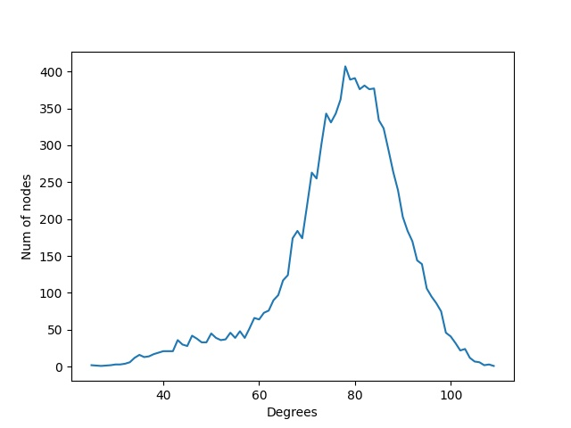
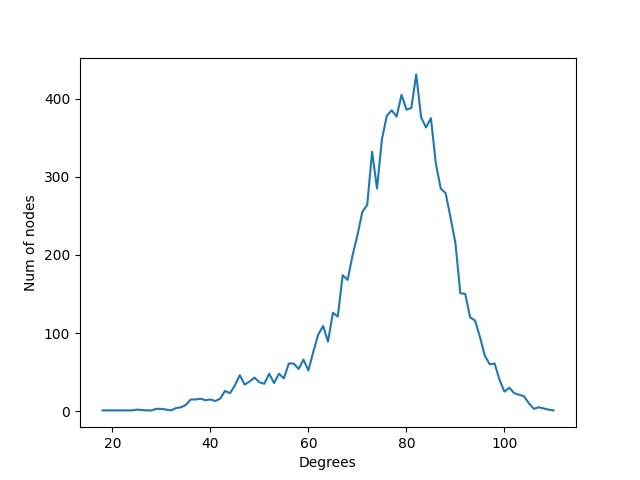

# Results

## Network features

1) Number of nodes 10000
2) Number of edges 388147
3) The node degree distribution does not follow a power law, but seems to follow a Gaussian with mean 77.6294 and
   standard deviation 12.64564176465552.
4) The network diameter is 6, so it is a Small world.
5) The network is connected.
6) The network clustering coefficient is 0.5745321712547844

### Summary

HIGH CLUSTERING COEFFICIENT : YES

SMALL WORLD : YES

POWER LAW : NO

## Theoretical properties

### randomG

This model tends to create a network with a low clustering coefficient, with a diameter of order of log (n) (therefore
not SMALL WORLD) and usually in these graphs the nodes have almost all the same degree.

HIGH CLUSTERING COEFFICIENT : NO

SMALL WORLD : NO (IT DEPENDS ON THE PROBABILITY USED, WITH P=0.005 THE DIAMETER è 4, WITH P=0.20 è 2)

POWER LAW : NO

From a theoretical point of view, this model can be excluded, because it does not reflect the network features.

### configurationG

This model is an extension of the probabilistic model, but it imposes on the generated network the node degree
distribution passed as input. Therefore, if for example a degree sequence from a power law is passed to it, then the
outgoing network will present a node degree distribution that reflects it.

In general this model presents these features:

HIGH CLUSTERING COEFFICIENT : NO

SMALL WORLD : NO

POWER LAW : DEPENDS ON THE DEGREE SEQUENCE PASSSED AS INPUT

From a theoretical point of view, this model can be excluded, because it does not reflect the network features.

### preferentialG

Questo modello tende a generare dei grafi la cui distribuzione dei gradi dei nodi rispecchia una power law. Inoltre di
solito le reti generate con questo modello non sono degli small world e non hanno alto indice di clusterizzazione.

This model tends to generate graphs whose node degree distribution reflects a power law. Furthermore, usually the
networks generated with this model are not small worlds and do not have a high clustering index.

In general this model has these features:

HIGH CLUSTERING COEFFICIENT : NO

SMALL WORLD : NO

POWER LAW : YES

Based on the theoretical considerations we can exclude this model, as the networks generated by it impose a node degree
distribution which is a power_law, while our network does not reflect this property. Furthermore it generally does not
return a network that is a small world and with a high clustering index both of which are true for the network under
consideration.

### Generalized Watts-Strogatz

This model usually generates networks that are a small world, which have high clustering index if nodes are adequately
arranged in space, but the node degree distribution does not usually reflect a power law.

HIGH CLUSTERING COEFFICIENT : DEPENDS ON HOW NODES ARE DISTRIBUTED IN THE FEATURE SPACE

SMALL WORLD : YES

POWER LAW : NO

Based on the theoretical considerations, this model is the best candidate because it reflects all the feature presented
by the network under consideration.

### affiliationG

This model has several input parameters, and is therefore difficult to use, but if the parameters are chosen adequately,
it presents the following features:

HIGH CLUSTERING COEFFICIENT: YES

SMALL WORLD : YES

POWER LAW : YES

Based on the theoretical considerations, this model could be excluded for the power law degree distribution it imposes
on the network generated.

## Experimental results

All the experiments were performed by comparing the following value with the network under consideration:

1) Average of the degrees of the nodes.
2) Standard deviation of the degrees of the nodes.
3) Graph degree->number of nodes, for an in-depth analysis of the node degree distribution.
4) Network diameter.
5) Clustering coefficient.

### randomG
Several experiments were carried out varying the parameter p of the model:

| p     | Considerations  |      
| ---- | ---- |
| (5e-05 - 0.0005) |  The mean and standard deviation of degrees tends to be very low (the graph is also unconnected so the diameter is infinite) moreover, the clustering coefficient is very low as expected.|      
| 0.005     |  The mean and standard deviation of the degrees tend to values comparable to those of the network in exam, 50 as average and 7 as std, even if still far from ours (77 and 12), the diameter is small 4 so the network is a Small world, but the clustering coefficient is very very low 0.005034 two orders of magnitude lower than those of the network in question.    |      
| (0.05 - 0.2)   |  The mean and the standard deviation of the degrees explode, the diameter is 2 this implies that the network is very connected, but the clustering coefficient remains much lower than that of the network under consideration.    |

For all the values of p, the degree distribution of the nodes seems to respect a Gaussian distribution with means and variances
different from each other and that strongly depend on the parameter p.

Comparison between the node degree distribution of the network under examination and that of the randomG model with p = 0.005

These experimental results reflect the theoretical analysis previously carried out, confirming the exclusion of
this model. In particular, the main differences between the network in exam and the ones generated using this model is
the clustering index and the node degree distribution.

### preferentialG
Several experiments were carried out varying the parameter p of the model:

|  p    |   degree mean   | degree std |  diameter | clustering coefficient|
| ---- | ---- |---- |---- |---- |
|   0.2   |   2  | 1.13 | None | 0 |
|   0.4   |   1.99   | 1.33 | None | 0 |
|   0.6   |   2   | 1.70 | None | 0 |
|   0.8   |   2   | 2.49 | None | 0 |

All the network generated using this model presented a power law as node degree distribution.

These experimental results reflect the theoretical analysis previously carried out. In addition, the degree mean and std
are completely different from the network in exam, the networks generated are not connected,so the diameter can not be evaluated,
and the node degree distributions follow a power law. All these differences make it possible to exclude this model.

### configurationG
It has been tried to generate a graph using this model and giving it as input exactly the node degree distribution
of the network in exam. The algorithm was unable to generate an output network in a half-day time span.
Therefore, it was decided to exclude it on the basis of the theoretical considerations already provided.

### GenWS2DG
The experimental analysis show that:
1) values of the radius less than 5, result in networks whose node degree distribution have a mean and standard deviation lower than that of the target network.
2) values of the radius greater than 5, result in networks whose node degree distribution have a mean and a standard deviation greater than that of the target network.

The value of the radius used for the creation of the target network is estimated to be 5.

The neighborhood of the radius values was not chosen randomly, but since the network contains 10000 nodes, the GenWS2DG algorithm tends to position the nodes in a space
sqrt (n) * sqrt (n) and therefore in this case 100 * 100. Considering this, values from 1 to 10 were initially considered reasonable and therefore it was decided to focus on these.

Analyzing the supplied network, it has been pointed out that there are no nodes whose degree is less than 19. So from this the upper limit for the k value was deduced.

Increasing the value of k, the diameter of the network tends to decrease, this is because having each node more weak ties, it is possible to reach any other node in the network
crossing less edges.

As regards the value q, accordingly with theoretical considerations, it is usually set equal to the node space dimensionality.
In this case the algorithm uses a two-dimensional space, consequently the values of q equal to 2 and 3 have been analyzed.
However, increasing q from 2 to 3, the diameter tends to increase, consequently, with values of q equal to 3 values of k closer to the upper limit were analyzed,
in such a way balancing the growth of the diameter. 
In fact, a network very similar to the target one was obtained using the combination:

'r':5 - 'k':20 - 'q'= 3:

The network obtained with these parameters presents a diameter equal to 7, slightly greater than the target's one.

Results even closer to the target network are obtained with smaller k and q equal to 2.
An example is the net obtained using the combination:

'r': 5 - 'k': 3 - 'q': 2:

|   r   |  k    |   q   |  degree mean   | degree std |  diameter | clustering coefficient |
| ---- | ---- | ---- | ---- | ---- | ---- | ----| 
|  target  |   target   | target | 77.62 | 12.64| 6 | 0.57 |
|   5  |   3   |   2   | 77.13 | 12.15 | 6 | 0.57 |
|   5   |   4   |   2   | 77.97 | 12.14 | 6 | 0.56 |
|   5  |    5  |   2   | 78.64| 11.84 | 5 | 0.55 |
|   5  |    10  |   2   | 82.72 | 12.51 | 5 | 0.51 |
|   5  |   20  |   3   | 77.38 | 12.50 | 7 | 0.58 |

Only some of the tests performed have been reported in this table, it is possible to analyze all
the tests carried out in the files in the results folder.

the GenWS2DG algorithm is probabilistic, in fact the nodes selected for the generation of weak ties 
are chosen through the numpy.random.choice() function, which uses the system time for the generation
of the seed, if this is not explicitly provided.
This implies that, even if the same parameters used for creating the target network are passed to the algorithm,
it will return a different network.

### affiliationG
Based on the theoretical considerations and the experimental results obtained from the GenWS2DG model, it was decided not to carry out
a precise tuning of the parameters of this model, as this would have required a very high amount of time and resources,
given the number of parameters and their nature. 
However, a series of tests were carried out, sampling random values as parameters. 
Even if the parameters of the model have not been carefully chosen, the results of these tests are very
different from the values of the target network.

Therefore, considering theoretical analysis and experimental results, it was decided to exclude this model.

## Model choice
In conclusion, the GenWS2DG was chosen as the model used to create the target network, with the following input parameters:

'n': 10000 'r': 5 'k': 3-5 'q': 2

